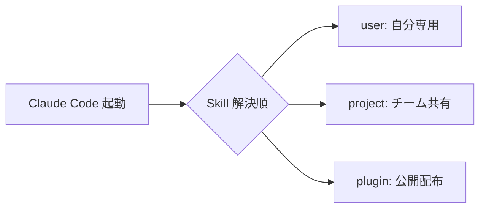
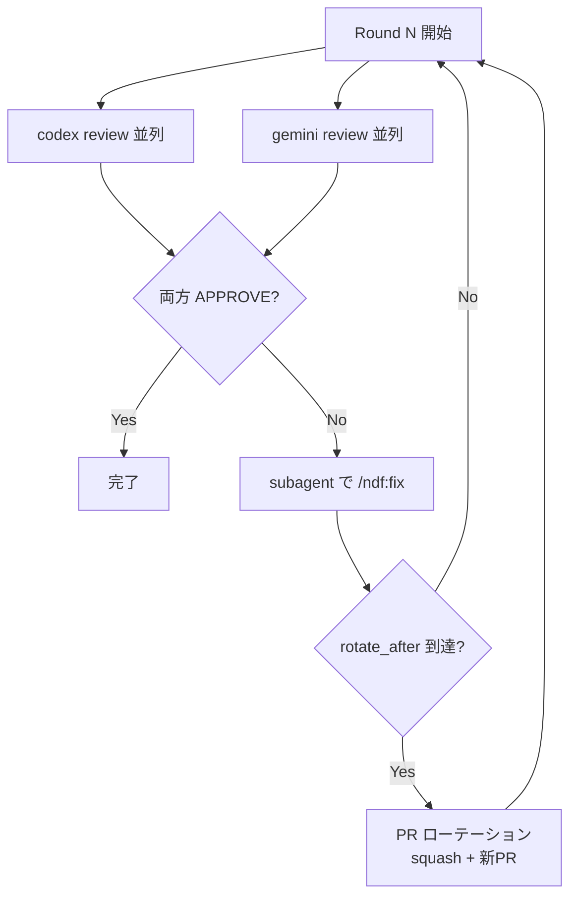
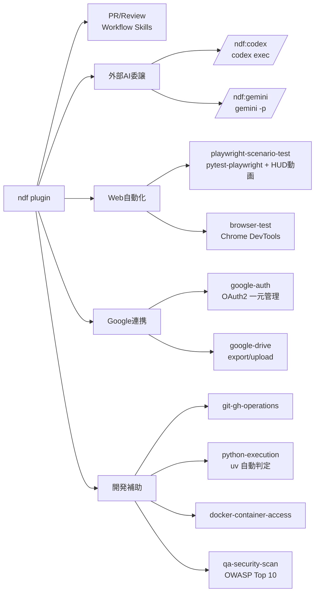

# NDF Plugin 紹介プレゼンテーション

> Claude Code 向け統合プラグイン `ndf` の紹介資料。NotebookLM での読み込みを想定し、1スライド=1セクションで構成する。

---

## スライド 1: タイトル / 何のプラグインか

**NDF Plugin — Claude Code 開発環境を統合する Skill / Agent / Hook パッケージ**

- リポジトリ: <https://github.com/takemi-ohama/ai-plugins>
- バージョン: v4.3.1
- 提供物
    - **Skill 38個**（PR/レビューワークフロー、原則ガイドライン、外部AI連携、Playwright E2E など）
    - **Sub Agent 8個**（director / corder / data-analyst / researcher / qa / debugger / devops-engineer / code-reviewer）
    - **自動 Hook**（SessionStart で transcript 保持期間管理 / Stop で AI 要約 → Slack 通知）
- ライセンス: MIT
- 動作環境: Claude Code（CLI / IDE / Web 共通）

---

## スライド 2: Claude Code における Skill 配布の3方式

Claude Code が Skill / Agent / Slash Command を取り込む経路は3つある。

| 方式 | 配置場所 | スコープ | 配布 |
|---|---|---|---|
| **user** | `~/.claude/skills/`, `~/.claude/agents/` | 自分の全プロジェクト共通 | 手動コピー |
| **project** | `<repo>/.claude/skills/` | 1リポジトリ内のみ | git で共有 |
| **plugin** | `~/.claude/plugins/<name>/` | インストールした全プロジェクト | marketplace 経由 |



---

## スライド 3: なぜ plugin 方式か

事実ベースの利点を列挙する。

- **インストール / 更新が1コマンド**
    - `/plugin marketplace add` → `/plugin install` でセットアップ完了
    - バージョン管理は `plugin.json` の semver で plugin 側に集約
- **複数の構成要素を一括提供**
    - 1 plugin に Skill / Sub Agent / Hook / MCP 定義を同梱できる（user / project 方式では個別管理）
- **チームを跨いだ再利用**
    - リポジトリ単位（project）ではなく、Marketplace 単位で広く共有できる
- **副作用の局所化**
    - `/plugin disable` で全機能をまとめて無効化可能。user / project は手動削除が必要

---

## スライド 4: ndf が目指すこと — 開発体験の共有

`ndf` の主目的は「個人の開発ワークフローを再現可能な形でチームに配布する」こと。

- 個人で蓄積したノウハウは通常、ローカル設定や暗黙知に閉じ込められる
- Claude Code は Skill / Agent でこれを **テキスト化** できる
- plugin として配布すれば、**同じ手順を別マシン・別人で実行可能** になる
- ndf はこの考えに基づき、PR 運用 / レビュー / デバッグ / Web テスト など普段使いの手順をひと通り収録している

スコープ:

- 「便利機能を全部入れる」ではなく「**一連のフローを完結させる**」ことを優先
- 例: 「PR を出す」一連の流れは `/ndf:pr` → `/ndf:pr-tests` → `/ndf:review` → `/ndf:fix` → `/ndf:merged` で閉じる

---

## スライド 5: 「固いフロー」を作る — スラッシュコマンド主義

ndf の Skill は、原則 `disable-model-invocation: true` を付け **モデル自動起動を禁止** している。

- 自動読み込み（model-invocation）は便利だが、**実行順序とタイミングがモデル任せ** になり再現性が低い
- ndf は**ユーザが明示的に `/ndf:xxx` を叩く** ことで、毎回同じ手順を踏むことを保証する
- これにより「PR 出し忘れ・テスト計画スキップ・Resolve 漏れ」といった揺らぎを排除

主要ワークフロー Skill:

| Skill | 役割 |
|---|---|
| `/ndf:pr` | commit + push + PR 作成 / 既存 PR 説明更新 |
| `/ndf:pr-tests` | PR の Test Plan を自動実行 |
| `/ndf:review` | PR 単位レビュー（Approve / Request Changes 判定） |
| `/ndf:fix` | PR レビューコメントへの修正対応 |
| `/ndf:cross-review` | codex / gemini 両方が APPROVE するまで自動ループ |
| `/ndf:resolve-pr-comments` | 対応済みコメント返信 + Resolve |
| `/ndf:merged` | マージ後のローカルブランチクリーンアップ |
| `/ndf:cherry-pick-pr` | 環境ブランチへの cherry-pick PR 作成 |
| `/ndf:sync-main` | 最新 main を現在ブランチに取り込み |

---

## スライド 6: 目玉機能 — クロスレビュー収束ループ

`/ndf:cross-review <PR>` は、**codex / gemini 両方** がレビューを返し、両者 APPROVE になるまで自動で `/ndf:review` と `/ndf:fix` を回す。



設計上の特徴（事実）:

- **メイン context を太らせない**: レビュー本文は AI 自身が `gh api` で投稿、修正は `general-purpose` サブエージェント側で実行
- **状態を `/tmp/cross-review-pr<番号>-state.json` に永続化** し、中断・再開可能
- **振動検知**: 前ラウンドと同じ指摘が 50% 以上重複したら自動中断
- **PR ローテーション**: 一定 round で squash + 新 PR を切り、巨大化を防ぐ

---

## スライド 7: 「MCP より CLI」の流れ

2026 年に入り、AI コーディングエージェント向けツール接続は **MCP よりも CLI 直叩きが推奨される** ケースが増えている。外部記事の論点は以下の通り。

- **トークン消費**: GitHub MCP は93ツールで起動時に約 55,000 token を context に積む。一方 `gh` CLI はモデル既知でスキーマ追加 0 token、実呼び出しも ~200 token 程度
- **信頼性**: 比較記事の計測で MCP は 25 試行中 7 件 TCP timeout、CLI は 100% 成功
- **構成性**: Unix の pipe / シェル合成は学習データに大量に存在し、モデルが扱い慣れている
- **学習量**: man page / Stack Overflow など、CLI の使用例の学習素材が圧倒的に多い

ただし MCP は **認証・多人数運用・企業ガバナンス** で優位なため、現実は併用が基本。

### ndf の判断

- 旧 v3 系で同梱していた **Codex MCP サーバを v4.0.0 で廃止**
- 代わりに `/ndf:codex` Skill / `corder` Agent から `codex exec` を **CLI 直接実行**
- Gemini も同様に `/ndf:gemini` Skill から CLI を呼ぶ
- Web 自動化は Playwright（CLI / Python ライブラリ）、Google 連携も Google API CLI / Python で実装

→ 「動かないときに自分でデバッグできる」「context を食わない」CLI を優先する方針。

---

## スライド 8: ndf に同梱されている CLI / ツール群



特徴的な Skill:

- **`playwright-scenario-test`**: pytest-playwright + axe-core (a11y) + Core Web Vitals 計測 + body_check（fatal/warning パターン検出）+ Markdown レポート + Google Drive 共有を fixture として提供
- **`google-auth`**: 単一トークンで Sheets / Drive / Calendar 等のスコープを一元管理。CLI / Python ライブラリ両方として使える
- **`skill-stats`**: transcript を集計して Skill 利用率を算出。description の網羅性チェックに使う

---

## スライド 9: インストール手順

前提:

- Claude Code 本体
- Python 3.10+ と `uvx`（Serena MCP 用 / 別プラグイン `mcp-serena` 経由）
- Codex CLI（外部AIレビューを使う場合）: `npm install -g @openai/codex` → `codex login`

インストール:

```bash
# 1. Marketplace を追加
/plugin marketplace add https://github.com/takemi-ohama/ai-plugins

# 2. NDF プラグイン本体をインストール
/plugin install ndf@ai-plugins

# 3. 必要に応じて MCP プラグインを追加（任意）
/plugin install mcp-chrome-devtools@ai-plugins   # Playwright相当
/plugin install mcp-bigquery@ai-plugins
/plugin install mcp-dbhub@ai-plugins
/plugin install mcp-aws-docs@ai-plugins
/plugin install mcp-notion@ai-plugins
/plugin install mcp-serena@ai-plugins            # コードインテリジェンス
```

環境変数（`.env`）:

```bash
SERENA_HOME=.serena
SLACK_BOT_TOKEN=xoxb-...      # Slack 通知用（任意）
SLACK_CHANNEL_ID=C...
SLACK_USER_MENTION=<@U...>
```

設定後に Claude Code を再起動するとフック・MCP が読み込まれる。

---

## スライド 10: まず ndf を、その先に「自分 plugin」を

ナイルのエンジニアにはまず `ndf` をそのまま使ってもらいたい。理由は単純で、PR / レビュー / マージ後クリーンアップといった**毎日繰り返す手順を最初から共有しておけば、レビュー体験と運用ノウハウがチーム内で揃う**ため。

- `/ndf:pr` → `/ndf:review` → `/ndf:fix` → `/ndf:cross-review` → `/ndf:merged` を全員が同じ手順で踏む
- 「私のところでは動く」状態を減らせる
- フィードバックを上げてもらえば本体側に反映できる（OSS / MIT）

その上で、**慣れてきたら自分の plugin を作るのが次のステップ**。

- 開発フローはチーム・言語・リリースサイクルで違うため、自分の手に馴染んだコマンド群を別途持っておくと効率が上がる
- plugin 化しておけば、PC 移行や新規参加者のオンボーディングが `/plugin install` 一発で済む
- 追加コストは低い: `skills/<name>/SKILL.md` を書いて `plugin.json` の skills 配列に追加するだけ

ndf の構成はそのまま雛形として流用可能:

- `plugins/<name>/.claude-plugin/plugin.json` … メタ情報
- `plugins/<name>/skills/<skill-name>/SKILL.md` … YAML frontmatter + 手順
- `plugins/<name>/agents/<agent-name>.md` … サブエージェント定義
- `plugins/<name>/hooks/hooks.json` … SessionStart / Stop など
- `plugins/<name>/.mcp.json` … MCP サーバ定義（必要時のみ）

ndf を共通土台に、各自の好みは個人 plugin に切り出す — この二段構えがチームと個人の両方にとって扱いやすい。

### 参考リンク

- Claude Code plugin ドキュメント: <https://docs.claude.com/en/docs/claude-code/plugins>
- Skill 仕様: <https://docs.claude.com/en/docs/claude-code/skills>
- 「CLI vs MCP」議論の例:
    - <https://jannikreinhard.com/2026/02/22/why-cli-tools-are-beating-mcp-for-ai-agents/>
    - <https://www.scalekit.com/blog/mcp-vs-cli-use>
    - <https://circleci.com/blog/mcp-vs-cli/>
