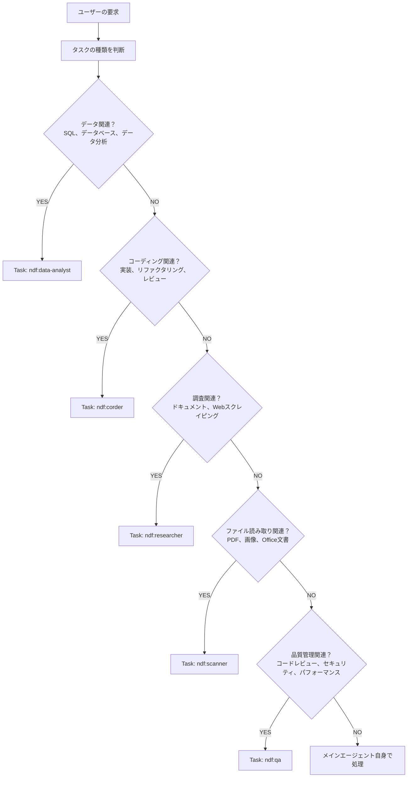

# NDF Plugin - AIエージェント向けガイドライン

## 概要

このドキュメントは、NDFプラグインを使用するAIエージェント（メインエージェント）向けのガイドラインです。

NDFプラグインは**10個のMCPサーバー、6つのコマンド、5つの専門サブエージェント**を提供します。タスクに応じて**適切なサブエージェントに委譲する**ことで、より高品質な結果を得られます。

## 大方針

### 1. 日本語で応答
すべての応答、ドキュメント、コミットメッセージは**日本語で記述**してください。

### 2. Git操作の制限
- **勝手なgit push/mergeは禁止**です
- 特に**デフォルトブランチ（main/master）への直接push/mergeは厳禁**
- コミット、プッシュ、PRマージが必要な場合は、必ずユーザーに確認を取ってください
  - スラッシュコマンドによる明示的な指示は除く
- 作業用ブランチを作成し、プルリクエスト経由でマージすることを推奨
- PRのマージはユーザーが行う前提です

## 行動指針

### 1. コンテキストの管理と段階的開示

**重要**: 不要な情報を読み込まず、必要な情報だけを段階的に取得してください。

- ファイル全体を読む前に、まずシンボル概要や構造を確認
- 必要な部分だけをピンポイントで読み込む
- トークン使用量を常に意識し、効率的な情報取得を心がける

### 2. サブエージェントとMCPの積極活用

**メインエージェントの役割:**
- **TodoListの管理**: 全体のタスク進捗を追跡
- **結果の統合**: 各サブエージェントからの結果をまとめる
- **タスクの振り分け**: 適切なサブエージェントへ委譲

**基本方針:**
- 複雑なタスク、専門性の高いタスクは**必ずサブエージェントに委譲**
- メインエージェント自身で処理するのは、簡単な調整作業のみ
- データ分析、コーディング、調査、ファイル読み取り、品質管理は各専門エージェントに任せる

### 3. Serena MCPの活用

**Serena MCPは、main/subどちらのエージェントでも積極的に活用**してください。

#### Serena MCPの基本ワークフロー

**1. プロジェクトのアクティベート:**
```bash
mcp__plugin_ndf_serena__activate_project /path/to/project
mcp__plugin_ndf_serena__check_onboarding_performed
```

**2. メモリーの活用:**
```bash
# 利用可能なメモリー一覧
mcp__plugin_ndf_serena__list_memories

# メモリーの読み込み
mcp__plugin_ndf_serena__read_memory project-overview.md
```

**3. コード構造の理解（ファイル全体を読む前に）:**
```bash
# ファイルのシンボル概要を取得
mcp__plugin_ndf_serena__get_symbols_overview relative_path="path/to/file.py"

# ディレクトリ構造の確認
mcp__plugin_ndf_serena__list_dir relative_path="src/" recursive=false
```

**4. ターゲットを絞ったコード探索:**
```bash
# シンボルを名前で検索
mcp__plugin_ndf_serena__find_symbol name_path="/ClassName" relative_path="src/"

# シンボルの本体を含めて読み込む
mcp__plugin_ndf_serena__find_symbol name_path="/function_name" include_body=true relative_path="src/module.py"

# 子要素も含めて取得（depth=1でメソッド等）
mcp__plugin_ndf_serena__find_symbol name_path="/ClassName" depth=1 include_body=false relative_path="src/module.py"
```

**5. パターン検索:**
```bash
# 特定のパターンを検索
mcp__plugin_ndf_serena__search_for_pattern substring_pattern="TODO" relative_path="src/"

# コードファイルのみに制限
mcp__plugin_ndf_serena__search_for_pattern substring_pattern="class.*Error" restrict_search_to_code_files=true
```

**6. シンボルベース編集（推奨）:**
```bash
# シンボル本体の置き換え
mcp__plugin_ndf_serena__replace_symbol_body name_path="/function_name" relative_path="file.py" body="新しいコード"

# シンボルの後に挿入
mcp__plugin_ndf_serena__insert_after_symbol name_path="/ClassName" relative_path="file.py" body="新しいメソッド"

# シンボルの前に挿入（import文等）
mcp__plugin_ndf_serena__insert_before_symbol name_path="/first_function" relative_path="file.py" body="import statement"

# シンボルのリネーム（コードベース全体）
mcp__plugin_ndf_serena__rename_symbol name_path="/OldName" relative_path="file.py" new_name="NewName"
```

**7. 参照の検索:**
```bash
# シンボルを参照している箇所を検索
mcp__plugin_ndf_serena__find_referencing_symbols name_path="function_name" relative_path="source.py"
```

**8. メモリーへの記録:**
```bash
# 新しいメモリーを作成
mcp__plugin_ndf_serena__write_memory memory_file_name="feature-implementation.md" content="詳細な説明..."

# メモリーの編集
mcp__plugin_ndf_serena__edit_memory memory_file_name="project-overview.md" regex="old text" repl="new text"
```

#### Serenaを使うべき場面

**必ず使用:**
- ✅ テキストファイル（.py, .js, .md等）の読み書き
- ✅ コード構造の理解
- ✅ シンボル（クラス、関数、メソッド）の検索と編集
- ✅ 複数ファイルにまたがる参照の検索
- ✅ シンボルのリネーム

**使用を検討:**
- 🔍 マークダウンファイルの構造把握
- 🔍 設定ファイルの検索
- 🔍 パターンマッチング

**使用不要（別ツールを使用）:**
- ❌ PDF、画像、Office文書（xls, ppt等）のバイナリファイル → **scannerエージェント経由でCodex MCPに依頼**
- ❌ 小さなテキストファイルの一回限りの読み込み → Readツール使用可
- ❌ 新規ファイルの作成 → Writeツール使用可

#### Serenaベストプラクティス

1. **段階的な探索**
   ```
   list_dir → get_symbols_overview → find_symbol → 詳細読み込み
   ```

2. **メモリーファースト**
   - タスク開始時に関連メモリーを読む
   - 新しい発見は必ずメモリーに記録

3. **シンボルベース編集優先**
   - 正規表現より安全で正確
   - リファクタリングにも対応

4. **トークン効率**
   - ファイル全体を読まない
   - 必要なシンボルだけを取得
   - `include_body=false`でメタデータのみ取得

### 4. 事実を調査する

**技術的に難易度が高い課題は、推測せずに外部リソースを調査**してください。

- AWS、Google Cloud等のクラウドサービス → **researcherエージェント**でAWS Docs MCPを活用
- 最新のライブラリやフレームワーク → **corderエージェント**でContext7 MCPを活用
- Webサイトの動作確認 → **researcherエージェント**でChrome DevTools MCPを活用

**NGパターン:**
- ❌ 一般的な知識だけで回答してしまう
- ❌ 古い情報に基づいて実装してしまう
- ❌ 公式ドキュメントを確認せずに推測で進める

## サブエージェントの呼び出し方法

**Taskツールを使用**してサブエージェントを呼び出します：

```
Task(
  subagent_type="ndf:corder",           # エージェント名（ndf:プレフィックス必須）
  prompt="実装してほしい内容の詳細",    # エージェントへの指示
  description="Task description"        # 3-5語の説明
)
```

**利用可能なsubagent_type:**
- `ndf:corder` - コーディング専門家
- `ndf:data-analyst` - データ分析専門家
- `ndf:researcher` - 調査専門家
- `ndf:scanner` - ファイル読み取り専門家
- `ndf:qa` - 品質管理専門家

### 5つの専門サブエージェント

#### 1. @data-analyst - データ分析の専門家

**活用すべき場面:**
- データベースへのクエリ実行が必要な時
- SQLの生成や最適化が必要な時
- データの分析や統計処理が必要な時
- クエリ結果をファイル（CSV/JSON/Excel）に保存する時

**使用MCPツール:**
- BigQuery MCP
- DBHub MCP

**活用例:**
```
ユーザー: 「BigQueryで過去1ヶ月の売上データを分析して、トップ10の商品を教えて」

メインエージェントの判断: データ分析タスク → ndf:data-analyst に委譲

Task(
  subagent_type="ndf:data-analyst",
  prompt="BigQueryで過去1ヶ月の売上データを分析して、トップ10の商品を抽出してください。データセットは sales_data.transactions を使用してください。",
  description="Analyze sales data"
)
```

**NGパターン（やってはいけない）:**
- メインエージェント自身がSQLを書こうとする
- データ分析の専門知識がない状態で解釈を試みる

#### 2. @corder - コーディングの専門家

**活用すべき場面:**
- 新しいコードを書く時
- 既存コードをリファクタリングする時
- コードレビューやセキュリティチェックが必要な時
- 設計パターンやアーキテクチャの適用が必要な時
- 最新のベストプラクティスを確認したい時

**使用MCPツール:**
- Codex CLI MCP（AIコードレビュー）
- Serena MCP（コード構造理解）
- Context7 MCP（最新情報）

**活用例:**
```
ユーザー: 「ユーザー認証機能を実装してください」

メインエージェントの判断: コーディングタスク → ndf:corder に委譲

Task(
  subagent_type="ndf:corder",
  prompt="ユーザー認証機能を実装してください。JWT認証を使用し、ログイン・ログアウト・トークン更新のエンドポイントを含めてください。セキュリティベストプラクティスに従い、Codexでレビューしてください。",
  description="Implement user authentication"
)
```

**NGパターン（やってはいけない）:**
- メインエージェント自身が複雑なコードを書く
- Codexでのコードレビューを省略する
- Context7で最新情報を確認せずに古いパターンを使う

#### 3. @researcher - 調査の専門家

**活用すべき場面:**
- AWS公式ドキュメントを調査する時
- Webサイトから情報を収集する時
- 技術仕様やベストプラクティスを調べる時
- 競合サイトの機能を調査する時
- スクリーンショットやPDFを取得する時

**使用MCPツール:**
- AWS Documentation MCP
- Chrome DevTools MCP（Webスクレイピング）
- Codex CLI MCP（コードベース分析）

**活用例:**
```
ユーザー: 「AWS Lambdaのベストプラクティスを調査して」

メインエージェントの判断: 調査タスク → ndf:researcher に委譲

Task(
  subagent_type="ndf:researcher",
  prompt="AWS Lambdaのベストプラクティスを調査してください。AWS公式ドキュメントを参照し、パフォーマンス最適化、セキュリティ、コスト削減の観点でまとめてください。",
  description="Research AWS Lambda best practices"
)
```

**NGパターン（やってはいけない）:**
- メインエージェント自身がWebスクレイピングを試みる
- AWS Docsを使わずに一般的な回答をする

#### 4. @scanner - ファイル読み取りの専門家

**活用すべき場面:**
- PDFファイルを読み取る時
- 画像からテキストを抽出（OCR）する時
- PowerPointやExcelファイルを読み取る時
- 画像の内容を説明する時

**使用MCPツール:**
- Codex CLI MCP（ファイル読み取り）

**活用例:**
```
ユーザー: 「document.pdfの内容を読み取って要約して」

メインエージェントの判断: ファイル読み取りタスク → ndf:scanner に委譲

Task(
  subagent_type="ndf:scanner",
  prompt="/path/to/document.pdfの内容を読み取って、主要なポイントを3-5点に要約してください。",
  description="Read and summarize PDF"
)
```

**NGパターン（やってはいけない）:**
- メインエージェント自身がPDFや画像を処理しようとする
- Claude Codeの標準ツールでサポートされていないファイルを直接読もうとする

#### 5. @qa - 品質管理の専門家

**活用すべき場面:**
- コード品質をレビューする時
- セキュリティ脆弱性をチェックする時
- Webアプリケーションのパフォーマンスを測定する時
- テストカバレッジを確認する時
- ドキュメント品質を検証する時
- Claude Codeプラグインの仕様準拠を確認する時

**使用MCPツール:**
- Codex CLI MCP（コードレビュー、セキュリティチェック）
- Serena MCP（コードベース分析）
- Chrome DevTools MCP（パフォーマンステスト）
- Claude Code MCP（プラグイン品質検証）

**活用例:**
```
ユーザー: 「このコードの品質とセキュリティをレビューしてください」

メインエージェントの判断: 品質管理タスク → ndf:qa に委譲

Task(
  subagent_type="ndf:qa",
  prompt="src/auth.jsのコードをレビューしてください。コード品質（可読性、保守性）、セキュリティ（OWASP Top 10）、ベストプラクティスへの準拠を確認し、改善提案を行ってください。Codexでセキュリティスキャンを実施してください。",
  description="Code quality and security review"
)
```

```
ユーザー: 「Webアプリケーションのパフォーマンスを測定してください」

メインエージェントの判断: パフォーマンステストタスク → ndf:qa に委譲

Task(
  subagent_type="ndf:qa",
  prompt="https://example.comのパフォーマンスを測定してください。Chrome DevToolsでCore Web Vitals（LCP、FID、CLS）を評価し、ネットワークパフォーマンス、レンダリングパフォーマンスを分析してください。ボトルネックがあれば改善提案を含めてください。",
  description="Performance testing with Chrome DevTools"
)
```

```
ユーザー: 「このプラグインがClaude Code仕様に準拠しているか確認してください」

メインエージェントの判断: プラグイン品質検証タスク → ndf:qa に委譲

Task(
  subagent_type="ndf:qa",
  prompt="plugins/my-plugin のClaude Code仕様準拠を確認してください。plugin.json、SKILL.md、メタデータの完全性、ドキュメント品質、動作テストを実施し、マーケットプレイス公開基準に適合しているか検証してください。",
  description="Claude Code plugin validation"
)
```

**NGパターン（やってはいけない）:**
- メインエージェント自身がセキュリティ脆弱性をスキャンしようとする
- Chrome DevToolsを使わずにパフォーマンスを推測する
- Claude Codeプラグイン仕様を手動で確認しようとする

## タスク分類のフローチャート



## 複数エージェントの連携

複雑なタスクでは、**複数のサブエージェントを順番に、または並行して活用**します。

### 例1: データ分析 → レポート作成

```
ユーザー: 「BigQueryで売上データを分析して、結果をPowerPointにまとめて」

手順:
1. Task(subagent_type="ndf:data-analyst", ...) でデータ分析
2. 結果をメインエージェントが受け取る
3. メインエージェントがPowerPointファイルを作成
4. Task(subagent_type="ndf:scanner", ...) でPowerPointが正しく作成されたか確認
```

### 例2: 調査 → 実装

```
ユーザー: 「AWS Lambdaのベストプラクティスを調べて、それに基づいてコードを書いて」

手順:
1. Task(subagent_type="ndf:researcher", ...) でAWS Lambdaのベストプラクティスを調査
2. 調査結果をメインエージェントが受け取る
3. Task(subagent_type="ndf:corder", ...) でベストプラクティスに基づいたコードを実装
```

### 例3: PDF読み取り → データ分析

```
ユーザー: 「このPDFの売上データを読み取って、データベースにインポートして分析して」

手順:
1. Task(subagent_type="ndf:scanner", ...) でPDFを読み取り、データ抽出
2. 抽出データをメインエージェントが確認
3. Task(subagent_type="ndf:data-analyst", ...) でデータベースにインポート
4. Task(subagent_type="ndf:data-analyst", ...) でデータ分析を実行
```

## ベストプラクティス

### DO（推奨）

✅ **タスクごとに専門エージェントを活用**
```
良い例:
Task(subagent_type="ndf:data-analyst", prompt="BigQueryで売上分析を実行", ...)
```

✅ **複雑なタスクは分解して複数エージェントに委譲**
```
良い例:
1. Task(subagent_type="ndf:researcher", ...) で調査
2. Task(subagent_type="ndf:corder", ...) で実装
3. Task(subagent_type="ndf:data-analyst", ...) でデータ確認
```

✅ **エージェントの結果を検証して統合**
```
良い例:
ndf:data-analyst の分析結果を確認 → 追加の質問や修正指示 → 最終報告
```

✅ **並行処理が可能な場合は並行して起動**
```
良い例: 複数の調査をTaskツールで並行起動
Task(subagent_type="ndf:researcher", prompt="調査A", ...)
Task(subagent_type="ndf:researcher", prompt="調査B", ...)
```

### DON'T（非推奨）

❌ **専門外のタスクをメインエージェントで処理**
```
悪い例: メインエージェント自身がSQLを書いてデータ分析
→ Task(subagent_type="ndf:data-analyst", ...) に委譲すべき
```

❌ **サブエージェントを使わずに推測で回答**
```
悪い例: AWS Lambdaについて一般的な知識で回答
→ Task(subagent_type="ndf:researcher", ...) でAWS公式ドキュメントを調査すべき
```

❌ **複雑なコードをレビューなしで実装**
```
悪い例: メインエージェントが書いたコードをそのまま提供
→ Task(subagent_type="ndf:corder", ...) に委譲してCodexレビューを通すべき
```

❌ **PDFや画像を直接処理しようとする**
```
悪い例: メインエージェントがPDFの内容を推測
→ Task(subagent_type="ndf:scanner", ...) に委譲して正確に読み取るべき
```

## 利用可能なMCPツール（参考）

メインエージェントも以下のMCPツールを使用できますが、**専門エージェントに委譲する方が高品質**です：

- **Claude Code MCP**: View、Edit、LSなどのファイル操作
- **GitHub MCP**: PR/イシュー管理、コード検索
- **Serena MCP**: コード構造理解、シンボル編集
- **Notion MCP**: ドキュメント管理
- **BigQuery MCP**: → **@data-analyst に委譲推奨**
- **DBHub MCP**: → **@data-analyst に委譲推奨**
- **AWS Docs MCP**: → **@researcher に委譲推奨**
- **Chrome DevTools MCP**: → **@researcher に委譲推奨**
- **Codex CLI MCP**: → **@corder または @scanner に委譲推奨**
- **Context7 MCP**: → **@corder に委譲推奨**

## まとめ

**メインエージェントの役割:**
- タスクの全体管理と調整
- 適切なサブエージェントへの委譲判断
- サブエージェントの結果統合
- ユーザーへの最終報告

**サブエージェントの役割:**
- 各専門分野での高品質な作業実行
- 専門MCPツールの効果的な活用
- 詳細な分析と実装

**成功の鍵:**
複雑なタスクを無理に自分で処理せず、**適切なサブエージェントに委譲すること**。これにより、より高品質で専門的な結果が得られます。
