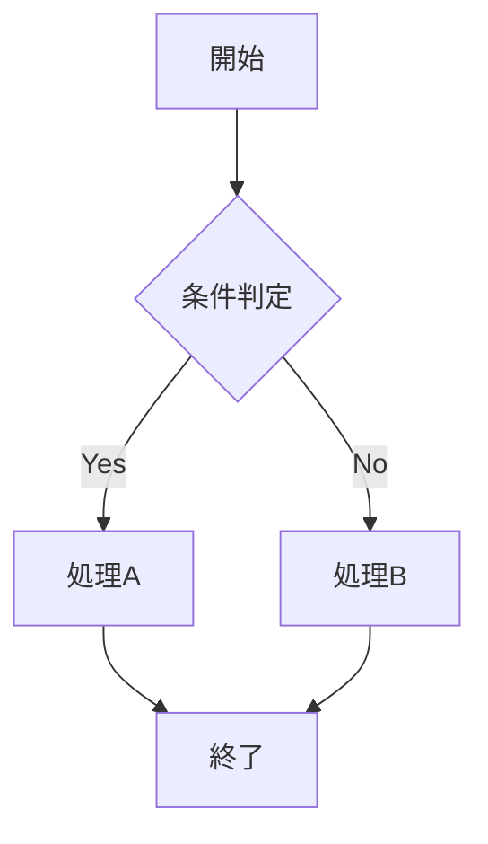
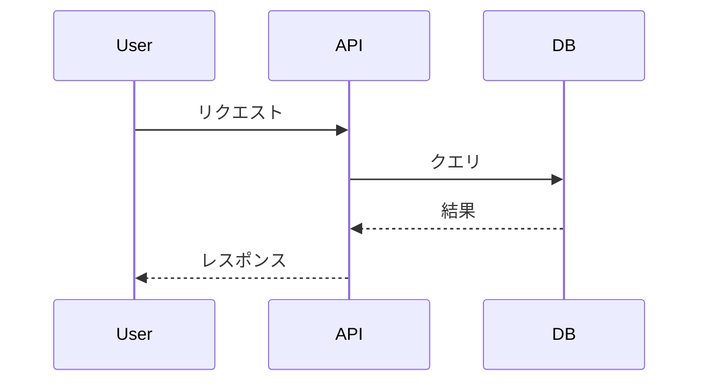
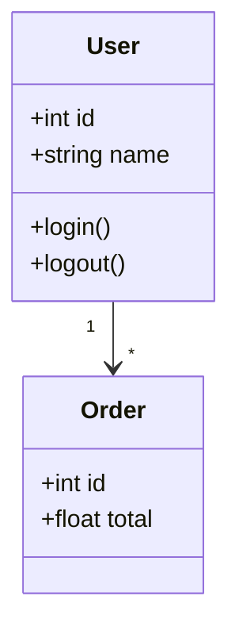
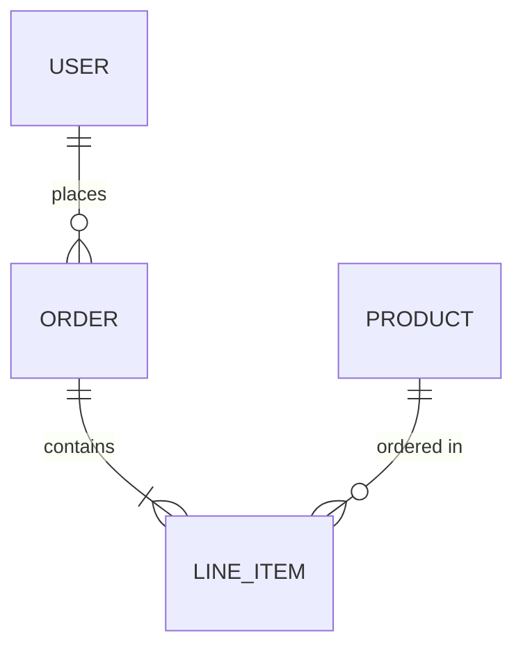
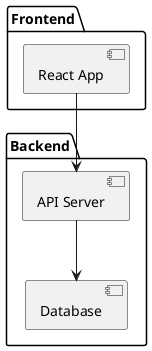
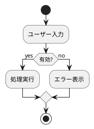
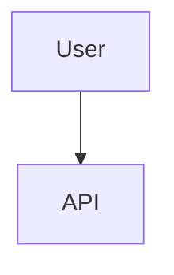

# 図表作成ガイド

## mermaid 記法

### フローチャート



### シーケンス図



### クラス図



### ER図



## plantUML 記法

### コンポーネント図



### アクティビティ図



## ASCII 許可例（ツリーのみ）

ディレクトリ構造はASCIIで表現可能:

```
project/
├── src/
│   ├── components/
│   └── utils/
├── tests/
└── docs/
```

## よくある間違い

### 避けるべき: ASCII ARTで図を描く

```
    ┌─────────┐
    │  User   │
    └────┬────┘
         │
    ┌────▼────┐
    │   API   │
    └─────────┘
```

上記のような図は **mermaid** で描いてください:



### 避けるべき: 順序prefixなしで分割

```
docs/
├── introduction.md  ← NG: prefixがない
├── setup.md
└── usage.md
```

正しい方法:

```
docs/
├── 01-introduction.md  ← OK
├── 02-setup.md
└── 03-usage.md
```

## ベストプラクティス

| DO | DON'T |
|----|-------|
| mermaid/plantUMLで図を描く | ASCII ARTで図を描く |
| 300行以内に収める | 1000行超の巨大ファイル |
| 順序prefixで分割 | prefixなしで分割 |
| 2桁パディング（01-, 02-） | 1桁（1-, 2-） |
