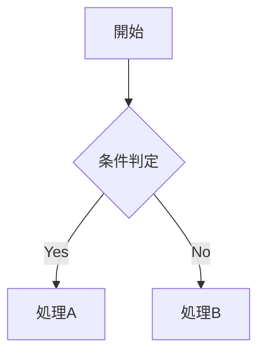
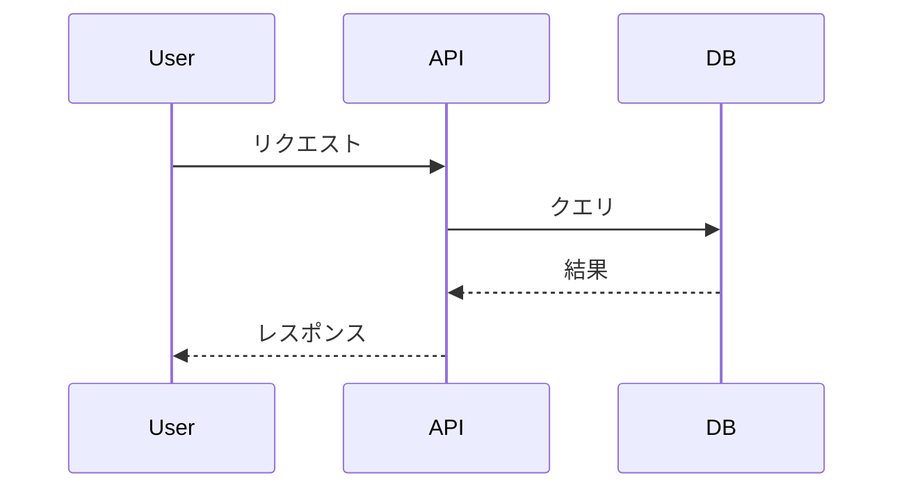
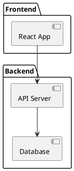
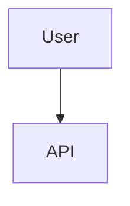

# Markdown Writing Skill

## 重要ルール

### 1. 図表作成ルール

**❌ ASCII ART は使用禁止**（例外: ディレクトリツリーのみ）

**✅ mermaid または plantUML を使用**

#### mermaid 例





#### plantUML 例



#### ASCII 許可例（ツリーのみ）

```
project/
├── src/
│   ├── components/
│   └── utils/
└── tests/
```

### 2. 文書の長さと分割ルール

**基本ルール**:
- **1ファイルあたり概ね300行以内**
- 300行超の場合は分割

**分割方法**:

```
docs/
└── feature-guide/
    ├── 01-introduction.md
    ├── 02-installation.md
    ├── 03-configuration.md
    └── 04-usage.md
```

**ファイル名規則**:
- 順序prefix: **パディング付き2桁**（01-, 02-, 03-, ...）
- ケバブケース（ハイフン区切り）

**分割の判断基準**:

| ページ数 | 対応 |
|---------|-----|
| ~300行 | そのまま |
| 301~600行 | 2ファイルに分割 |
| 601~900行 | 3ファイルに分割 |
| 900行以上 | セクションごとに分割 |

## チェックリスト

- [ ] 図表はmermaid/plantUML使用（ツリー除く）
- [ ] ファイル長は300行以内（超える場合は分割）
- [ ] 分割時は順序prefix使用（01-, 02-, ...）

## よくある間違い

### ❌ 避けるべき

**ASCII ARTで図を描く**:
```
    ┌─────────┐
    │  User   │
    └────┬────┘
         │
    ┌────▼────┐
    │   API   │
    └─────────┘
```

**順序prefixなしで分割**:
```
docs/
├── introduction.md  ← NGプレfixがない
├── setup.md
└── usage.md
```

### ✅ 推奨

**mermaidで図を描く**:


**順序prefixあり**:
```
docs/
├── 01-introduction.md  ← OK
├── 02-setup.md
└── 03-usage.md
```
