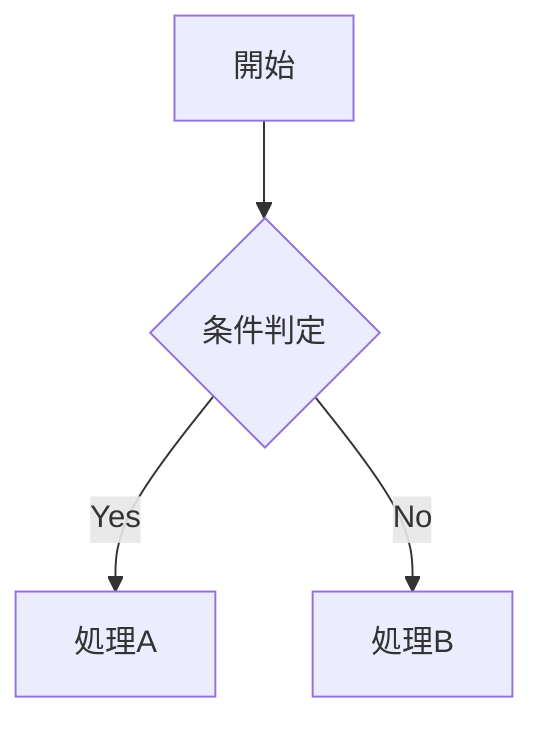

# Markdown Writing Skill

## 重要ルール

### 1. 図表作成ルール

**mermaid または plantUML を使用**（ASCII ART禁止、ツリー除く）



### 2. 文書の長さと分割ルール

| ページ数 | 対応 |
|---------|-----|
| ~300行 | そのまま |
| 301~600行 | 2ファイルに分割 |
| 600行以上 | セクションごとに分割 |

**分割時のファイル名**: 順序prefix（01-, 02-, ...）+ ケバブケース

```
docs/feature-guide/
├── 01-introduction.md
├── 02-installation.md
└── 03-usage.md
```

## チェックリスト

- [ ] 図表はmermaid/plantUML使用（ツリー除く）
- [ ] ファイル長は300行以内（超える場合は分割）
- [ ] 分割時は順序prefix使用（01-, 02-, ...）

## 詳細ガイド

| ファイル | 内容 |
|---------|------|
| `01-diagram-guide.md` | mermaid/plantUML記法、よくある間違い |

## 関連リソース

- [Mermaid公式ドキュメント](https://mermaid.js.org/)
- [PlantUML公式ドキュメント](https://plantuml.com/)
