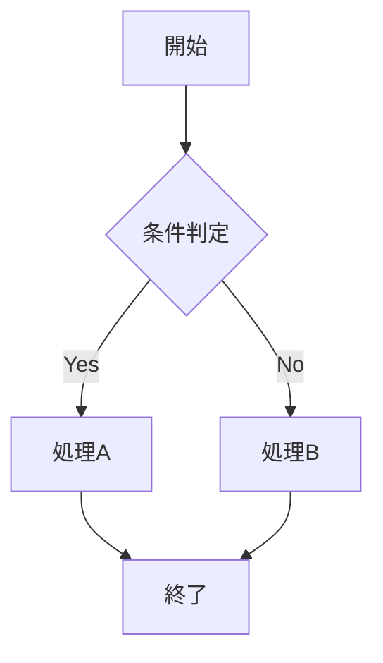
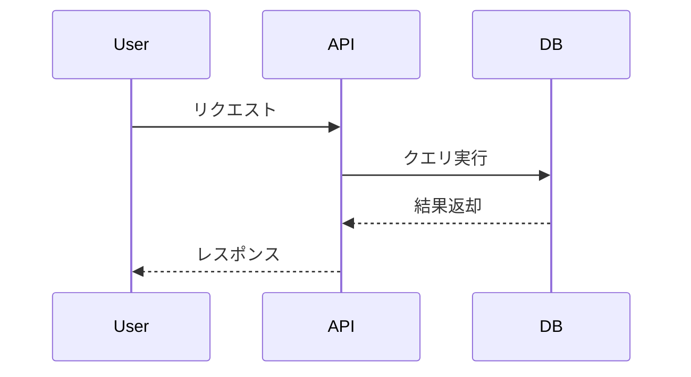
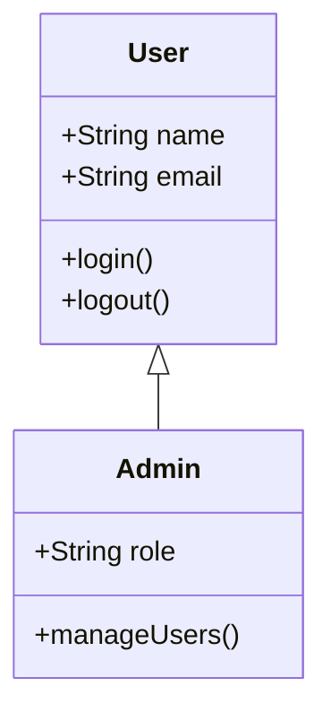
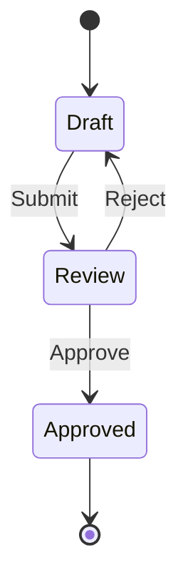
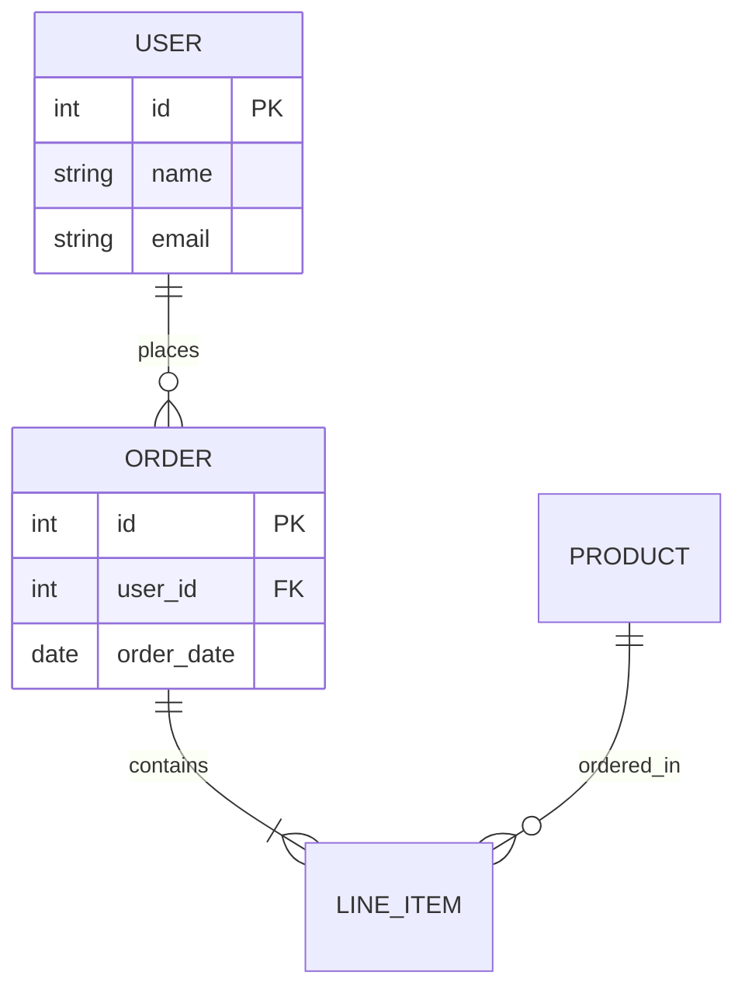
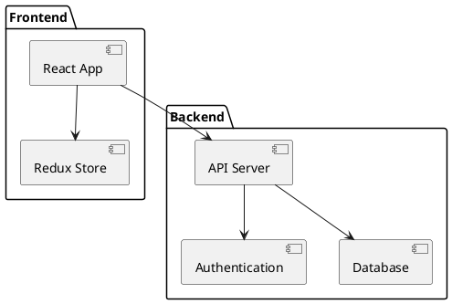
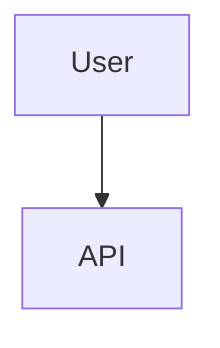

# Markdown Writing Skill

## 概要

このSkillは、Markdown文書を作成する際の標準的なルールとベストプラクティスを提供します。技術文書、仕様書、README、ガイドなど、あらゆる種類のMarkdown文書作成に活用できます。

## 主要ルール

### 1. 図表の作成ルール

#### ✅ 推奨: mermaid または plantUML を使用

**ASCII ART は使用しない**（例外: ツリー構造のみ）

**mermaid を使用するケース**:
- フローチャート
- シーケンス図
- 状態遷移図
- ガントチャート
- クラス図
- ER図
- Git グラフ

**plantUML を使用するケース**:
- 複雑なクラス図
- 詳細なコンポーネント図
- デプロイメント図
- オブジェクト図
- タイミング図

**ASCII のまま許可されるケース**:
- ディレクトリツリー構造の表現

#### 図表作成例

**mermaid - フローチャート**:


**mermaid - シーケンス図**:


**mermaid - クラス図**:


**mermaid - 状態遷移図**:


**mermaid - ER図**:


**plantUML - コンポーネント図**:


**ASCII 許可例 - ディレクトリツリー**:
```
project/
├── src/
│   ├── components/
│   │   ├── Header.tsx
│   │   └── Footer.tsx
│   ├── utils/
│   │   └── helpers.ts
│   └── index.ts
├── tests/
│   └── components/
│       └── Header.test.tsx
└── package.json
```

### 2. 文書の長さと分割ルール

#### 基本ルール

- **1ファイルあたり概ね300行以内**を目安とする
- 300行を超える場合は、ディレクトリを作成してファイルを分割

#### 分割方法

**ディレクトリ構造**:
```
docs/
└── feature-guide/
    ├── 01-introduction.md
    ├── 02-installation.md
    ├── 03-configuration.md
    ├── 04-usage.md
    └── 05-troubleshooting.md
```

**ファイル名規則**:
- **順序prefix**: パディング付き2桁（01-, 02-, 03-, ...）
- **説明的な名前**: 内容を表す簡潔な名前
- **ケバブケース**: ハイフン区切り

**分割の判断基準**:

| ページ数 | 対応方法 |
|---------|---------|
| ~300行 | 1ファイルのまま |
| 301~600行 | 2ファイルに分割 |
| 601~900行 | 3ファイルに分割 |
| 900行以上 | セクションごとに分割（目安: 各200~300行） |

#### 分割例

**Before（700行の長大なファイル）**:
```
README.md (700行)
```

**After（分割）**:
```
docs/
└── user-guide/
    ├── 01-getting-started.md  (200行)
    ├── 02-core-features.md    (250行)
    ├── 03-advanced-usage.md   (200行)
    └── 04-api-reference.md    (250行)
```

### 3. 文書構造のベストプラクティス

#### 見出しの使い方

```markdown
# タイトル（H1）- 1つのみ

## セクション（H2）- 主要な区分

### サブセクション（H3）- 詳細な項目

#### 詳細（H4）- さらに細かい内容
```

**推奨事項**:
- H1は1ファイルに1つ
- 見出しレベルをスキップしない（H2の次にH4は使わない）
- 見出しは簡潔で説明的に

#### リストの使い方

**箇条書きリスト（順序なし）**:
```markdown
- 項目1
- 項目2
  - ネストした項目2.1
  - ネストした項目2.2
- 項目3
```

**番号付きリスト（順序あり）**:
```markdown
1. 最初のステップ
2. 次のステップ
3. 最後のステップ
```

**チェックリスト**:
```markdown
- [ ] 未完了タスク
- [x] 完了済みタスク
- [ ] 進行中タスク
```

#### コードブロック

**言語指定は必須**:
```markdown
\```javascript
const greeting = "Hello, World!";
console.log(greeting);
\```
```

**ファイルパスやコマンドを明示**:
```markdown
\```bash
# ファイル: scripts/deploy.sh
npm run build
npm run deploy
\```
```

#### 表の作成

**基本的な表**:
```markdown
| カラム1 | カラム2 | カラム3 |
|--------|--------|--------|
| データ1 | データ2 | データ3 |
| データ4 | データ5 | データ6 |
```

**配置指定**:
```markdown
| 左寄せ | 中央寄せ | 右寄せ |
|:-------|:--------:|-------:|
| Left   | Center   | Right  |
```

### 4. アクセシビリティとSEO

#### 画像の代替テキスト

```markdown

```

#### リンクの記述

**説明的なリンクテキスト**:
```markdown
[プラグインのインストール方法](./installation.md)
```

**避けるべき例**:
```markdown
[こちら](./installation.md)をクリック
```

### 5. メタ情報とフロントマター

**YAMLフロントマター（必要に応じて）**:
```markdown
---
title: プラグイン開発ガイド
description: Claude Code プラグインの開発方法
version: 1.0.0
date: 2026-01-30
author: takemi-ohama
tags: [plugin, development, guide]
---

# プラグイン開発ガイド
...
```

## 実践ガイド

### 技術文書作成のワークフロー

1. **構造設計**
   - 目次を作成
   - 主要セクションを決定
   - 分割の必要性を判断

2. **コンテンツ作成**
   - 見出しを先に配置
   - 各セクションを執筆
   - コード例を追加

3. **図表追加**
   - 必要な箇所にmermaid/plantUML図を追加
   - ディレクトリツリーはASCII表現

4. **レビューと最適化**
   - 行数チェック（300行以内？）
   - 見出し構造の確認
   - リンクの動作確認

5. **分割（必要な場合）**
   - ディレクトリ作成
   - ファイル分割（01-, 02-, ...）
   - ナビゲーションリンク追加

### 文書分割の具体例

**元のファイル（500行）**:
```markdown
# Complete Guide

## Introduction
...（100行）

## Installation
...（150行）

## Configuration
...（150行）

## Usage
...（100行）
```

**分割後**:

`docs/complete-guide/01-introduction.md`:
```markdown
# Complete Guide - Introduction

[Next: Installation →](./02-installation.md)

## Introduction
...（100行）
```

`docs/complete-guide/02-installation.md`:
```markdown
# Complete Guide - Installation

[← Previous: Introduction](./01-introduction.md) | [Next: Configuration →](./03-configuration.md)

## Installation
...（150行）
```

`docs/complete-guide/03-configuration.md`:
```markdown
# Complete Guide - Configuration

[← Previous: Installation](./02-installation.md) | [Next: Usage →](./04-usage.md)

## Configuration
...（150行）
```

`docs/complete-guide/04-usage.md`:
```markdown
# Complete Guide - Usage

[← Previous: Configuration](./03-configuration.md)

## Usage
...（100行）
```

## チェックリスト

文書作成時に以下をチェック：

- [ ] H1見出しは1つのみ
- [ ] 見出しレベルは順序通り（スキップなし）
- [ ] コードブロックに言語指定あり
- [ ] 図表はmermaid/plantUML使用（ツリー除く）
- [ ] ファイル長は300行以内（超える場合は分割）
- [ ] 分割時は順序prefix使用（01-, 02-, ...）
- [ ] リンクは説明的なテキスト使用
- [ ] 画像に代替テキストあり
- [ ] 表の配置は適切

## よくある間違い

### ❌ 避けるべき例

**ASCII ARTで図を描く**:
```
    ┌─────────┐
    │  User   │
    └────┬────┘
         │
    ┌────▼────┐
    │   API   │
    └─────────┘
```

**300行超のファイルをそのまま維持**:
```
README.md (800行) ← 分割すべき
```

**順序prefixなしでファイル分割**:
```
docs/
├── introduction.md
├── setup.md
└── usage.md
```

### ✅ 推奨する例

**mermaidで図を描く**:


**適切な長さに分割**:
```
docs/guide/
├── 01-introduction.md (150行)
├── 02-setup.md (200行)
└── 03-usage.md (250行)
```

**順序prefixあり**:
```
docs/
├── 01-introduction.md
├── 02-setup.md
└── 03-usage.md
```

## まとめ

このSkillを活用することで：

1. **視覚的に優れた文書**: mermaid/plantUMLで図表を作成
2. **管理しやすい構造**: 適切な長さに分割された文書
3. **ナビゲーション性**: 順序prefixによる明確な順序
4. **保守性**: 一貫したスタイルと構造

Markdown文書作成時は、このSkillを参照して、読みやすく保守しやすい文書を作成してください。
